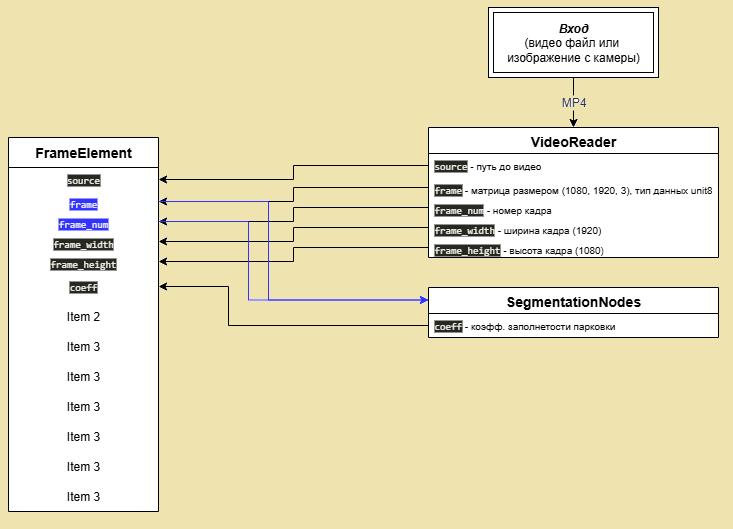

# [парковка]

## Цель: 
### 1. Вычислять наличие пустых мест на парковке в текущий момент
### 2. Собирать статистику по наличию пустых мест в зависимости от времени суток, сезона, может быть погоды.

>Т.к. вида сверху нет, места не расчерчены и машины могут боле менее стоять как попало, будем действовать таким образом, для начала обучу семантическую сегментацию с помощью Unet. В которой будут две маски, одна маска - это площаь парковки без учета наличия машин, вторая - пятна машин на парковке. Да, еще есть проезд, который всегда есть, буду его учитывать в процентром соотношении от всей площади парковки (пропорцию найду, когда вся парковка будет занята). В результате две маски будут сравниваться пропорционально, чем ниже число от 0 до 1, тем свободней парковка. Назначаем порог, ниже которого данные просто будут отправляться в БД, если значение будет выше порогового, то данные будут передаваться в следующую модель. 
>
>Следующая модель: это будет модель детекции YOLOv8 c повернутыми Bbox-ами, которая будет обучена на почти полной парковке, с целью поиска конкретных свободных мест (конкретный подсчет). Т.к. имеетместо перспектива и места расположенные дальше смотрятся меньше, поэтому возможно придется ввести коэффициент: разбить экран горизонтальными линиями и чем выше свободное место (выше - это значит дальше), тем выше коэффициент, т.к. удалением места визуально уменьшаются, ну здесь еще посмотрим. Возможно это будет и сегментация еще одна

Для моей карты 5060ti установка torch + CUDA: **pip3 install torch torchvision torchaudio --index-url https://download.pytorch.org/whl/cu128**

Результат обучения модели Unet можно видеть ниже (она нашла даже машины на парковке, которые я почему-то не разметил, точней меня выходит:)):

По картинке видно, что модель Unet обучяется боле менее хорошо, в принципе такое качество достаточно, чтобы в первом приближении определить есть пустые парковочные места или их нет. 
Математическая часть: вводим коффициент, т.к. камера у нас может передвигаться и парковку +/- видно по-разному, поэтому находит отношение пятен машин к участку парковки без машин и выводим график, где визуально видно, что кэффициенты фактического отношения и предсказаннго довольно близки:

Пороговым коэффициентом исходя из графика возьмем значение 0.58, т.е. значение ниже будет определять, что свободные места есть 100%, а если значение будет выше, то данные будут передаваться в следующую нейронку YOLOv8, которая будет обучена находить повернутые баундинбоксы (пустые места) и их количество.

Теперть нужно собрать как можно разнообразные данные с почти полной парковкой...
Данные собраны, модель обучена, моделька обучалась YOLO8m-obb, результаты видны внизу:

В общем на картинке лева показана разметка картинок с указанием пустых мест, а справа уже моделька сама находит пустые места, меня в принципе все устраивает, не смотря, что выделенные места не показывают переспективу, возможно создатели YOLO не знают, что это такое, в любом случае результаты очень хорошие, теперь на основе обученных моделек Unet и YOLO8m-obb соираем программку для определения наличия пустых мест. Понравилось, что сетка поняла, куда одну, куда две, а куда и три машинки ставить, умная все-таки.

Компануем данные с помощью Hydra, потом все запихаем в контейнер Docker.

### Блок SegmentationNodes:

Пользовательские данные дают результат похуже, даже смотреть на это не очень)), можно сделать лучше (позанимаюсь еще), но могу сказать, что такай маска абсолюно устраивает для дальней шей работы. Это связано с тем, что на выходе из блока будет только коэффициент (отношение площади машин к площади парковки (желтое к оранжевому)), для дальнейшей работы приложения маска нам не нужна. Назовем наш коэффициент - коэффициент k, он будет решать будут ли данные просто отправлены в БД (т.е. места на парковке есть точно и детекция не требуется), либо данные пойдут дальше в более точную модель уже детекции YOLO8m-obb, а затем уже все данные будут отправдены в БД.

Структура(еще в процессе, не полная):

